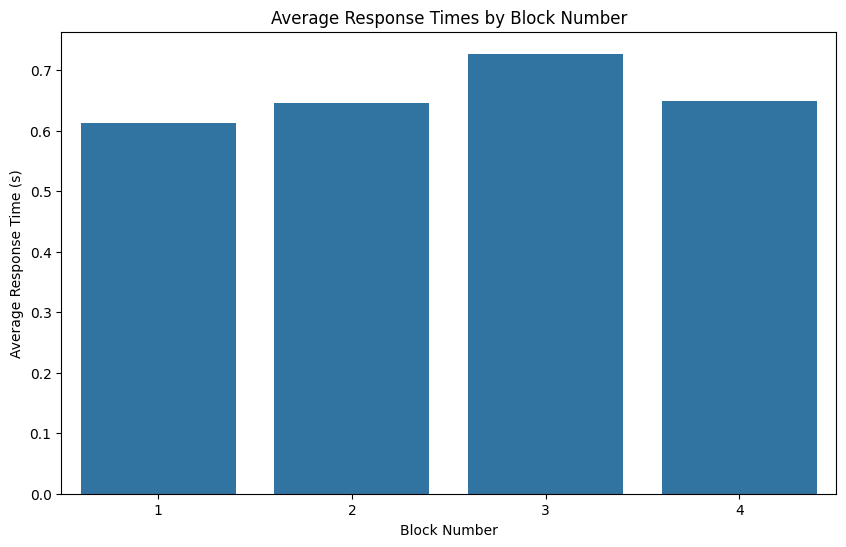
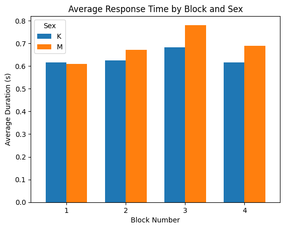
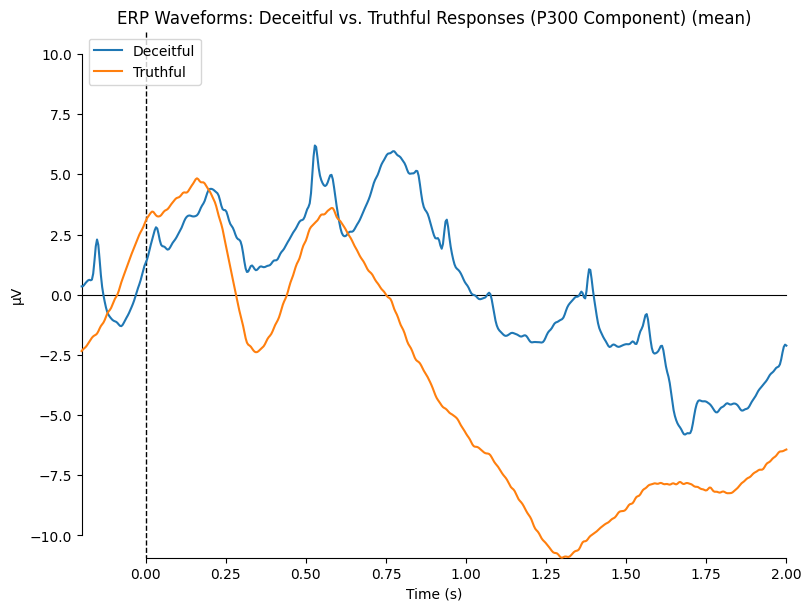
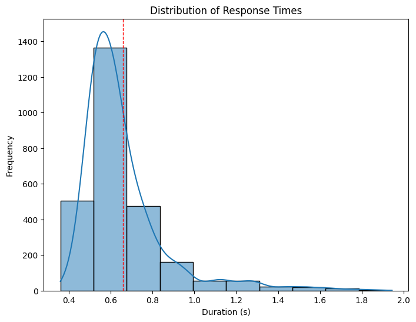
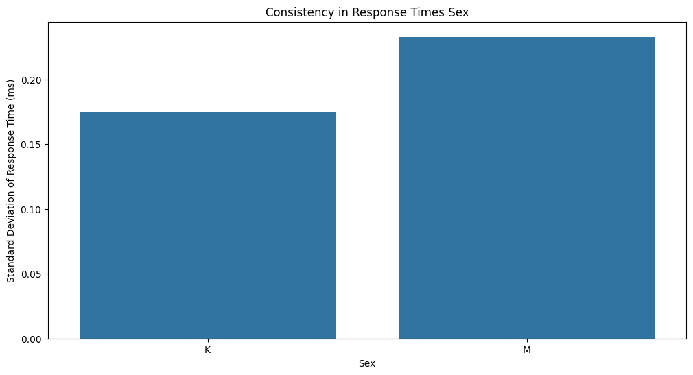

# EDA Folder

## Overview

The EDA (Exploratory Data Analysis) folder contains Jupyter notebooks used for exploring and visualizing the EEG data. The insights gained from this analysis were primarily used for understanding the data and generating interesting plots for the publication. However, the findings from this analysis were not directly used in the training models.

## Notebooks

### `eda.ipynb`

This notebook contains various plots and exploratory analyses of the EEG data. It was used to generate insights and fun facts about the data, but the information was not directly used in the training models.

#### Key Plots and Analyses

- **Response Times by Block**: Visualizes the average response times across different blocks.
- **Response Times by Gender**: Compares the average response times between different genders.
- **Distribution of Response Times**: Shows the distribution of response times across all participants.
- **Participant Consistency**: Analyzes the consistency of response times for each participant.
- **Age-Related Differences**: Examines the relationship between age and response times.
- **Incorrect Answers by Block**: Visualizes the count of incorrect answers across different blocks.

### `plots_for_paper.ipynb`

This notebook contains plots and analyses that were used in the publication. It highlights interesting findings and fun facts about the data and the examined participants.

#### Key Plots and Analyses

- **Average Response Times by Block**: Shows the average response times for each block.
- **ERP Plots**: Visualizes the Event-Related Potentials (ERPs) for different conditions.
- **Response Time Distribution**: Shows the distribution of response times.
- **Participant Consistency by Gender**: Analyzes the consistency of response times for each gender.

## Example Plots

### Average Response Times by Block

### Average Response Times by Gender

### ERP Plot

### Response Time Distribution

### Participant Consistency by Gender

## Conclusion

The EDA folder provides valuable insights and visualizations that help in understanding the EEG data. While the findings were not directly used in the training models, they offer interesting perspectives and fun facts about the data and the participants.
