# Neural Networks

## Overview

This folder contains the implementation and results of various neural network models used in our experiments. It includes scripts for training and evaluating models such as DGCNN, FBCNet, and LSTM on different data splits.

## Folder Structure

- `README.md`: Documentation for the Neural Networks folder.
- `constants.py`: Constants used in neural network models.
- `dgcnn_final_model.py`: Final model script for DGCNN.
- `fbcnet_final_model.py`: Final model script for FBCNet.
- `lstm_final_model.py`: Final model script for LSTM.
- `neural_networks_run.py`: Script to run neural network models.
- `typings.py`: Type definitions.

### `dataset`

Contains dataset-related scripts and files.

- `bde_dataset.py`: Script for BDE dataset.
- `eeg_dataset.py`: Script for EEG dataset.
- `microvolt_dataset.py`: Script for Microvolt dataset.

### `previous_results_just_in_case`

Contains backup of previous results for different data splits.

- `Random2137`: Previous results for the Random2137 split.
- `Random42`: Previous results for the Random42 split.
- `SmallTest42`: Previous results for the SmallTest42 split.
- `SubjectBased42`: Previous results for the SubjectBased42 split.

### `results`

Contains the results for different data splits.

- `Random2137`: Results for the Random2137 split.
  - `neural_networks`: Contains results for DGCNN, FBCNet, and LSTM models.
- `Random42`: Results for the Random42 split.
  - `neural_networks`: Contains results for DGCNN, FBCNet, and LSTM models.
- `SmallTest42`: Results for the SmallTest42 split.
  - `neural_networks`: Contains results for DGCNN, FBCNet, and LSTM models.
- `SubjectBased42`: Results for the SubjectBased42 split.
  - `neural_networks`: Contains results for DGCNN, FBCNet, and LSTM models.

## Usage

To get started, explore the `neural_networks_run.py` script to understand how to run the neural network models. Use the individual model scripts (`dgcnn_final_model.py`, `fbcnet_final_model.py`, `lstm_final_model.py`) to implement and train the respective models. Analyze the results using the JSON files in the `results` folder.

## Confusion Matrices

Below are the confusion matrices for the best-performing neural network models across different splits:

### DGCNN Model

#### Random2137 Split

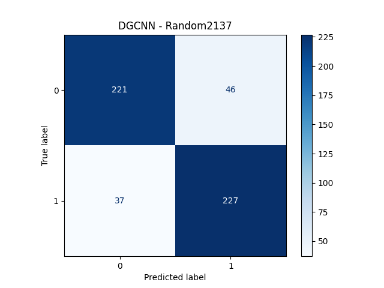

#### Random42 Split

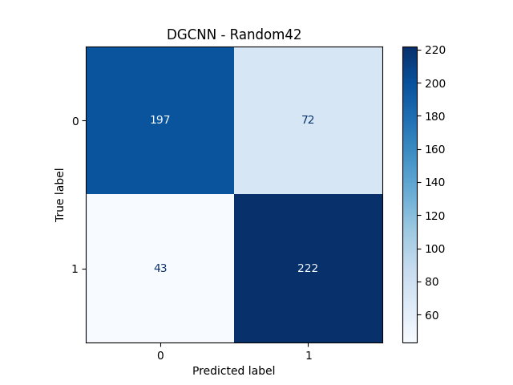

#### SmallTest42 Split

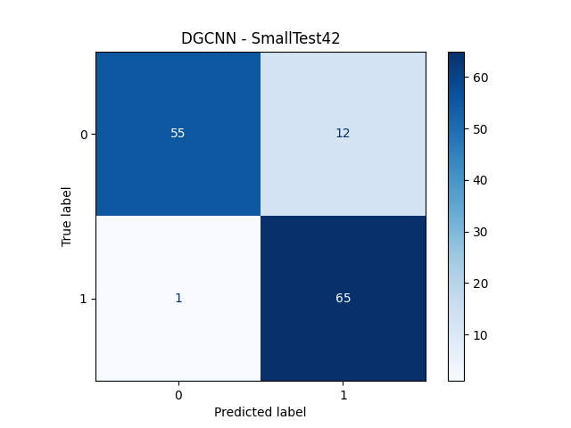

#### SubjectBased42 Split

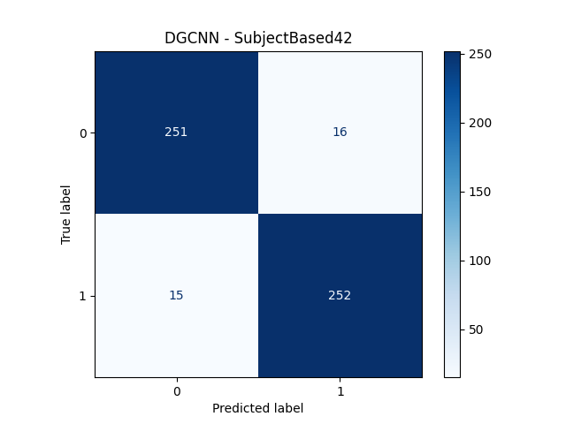

### FBCNet Model

#### Random2137 Split

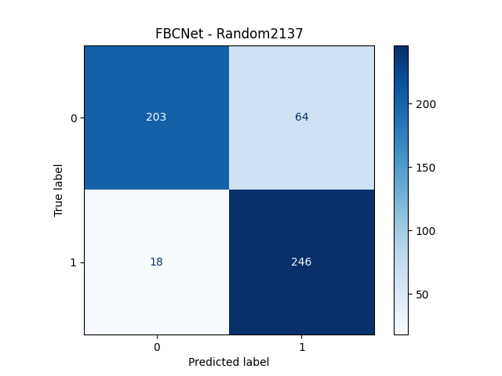

#### Random42 Split

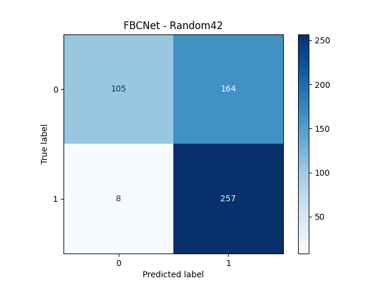

#### SmallTest42 Split

#### SubjectBased42 Split

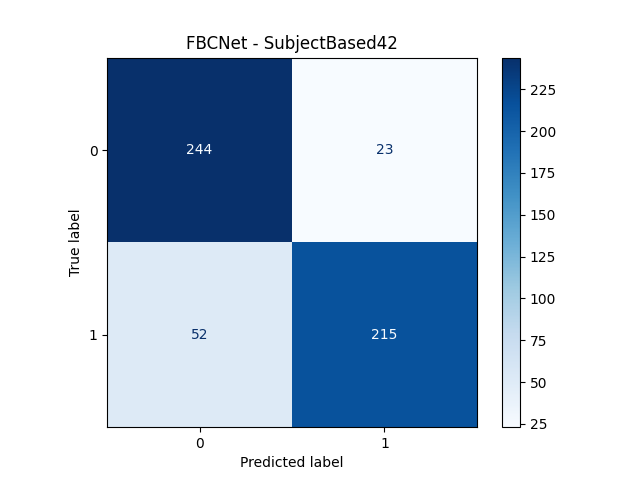

### LSTM Model

#### Random2137 Split

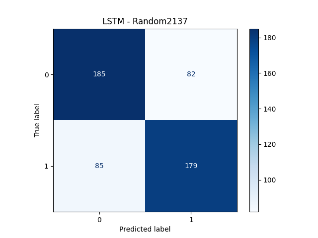

#### Random42 Split

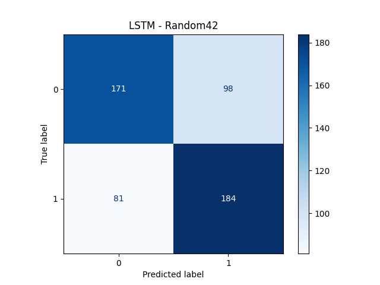

#### SmallTest42 Split

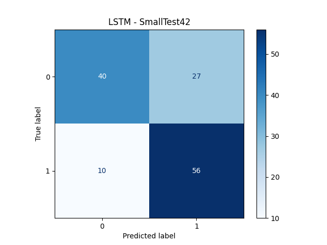

#### SubjectBased42 Split

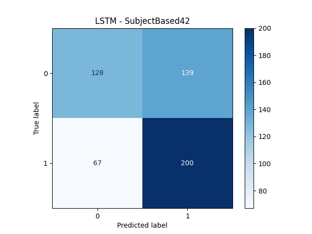
