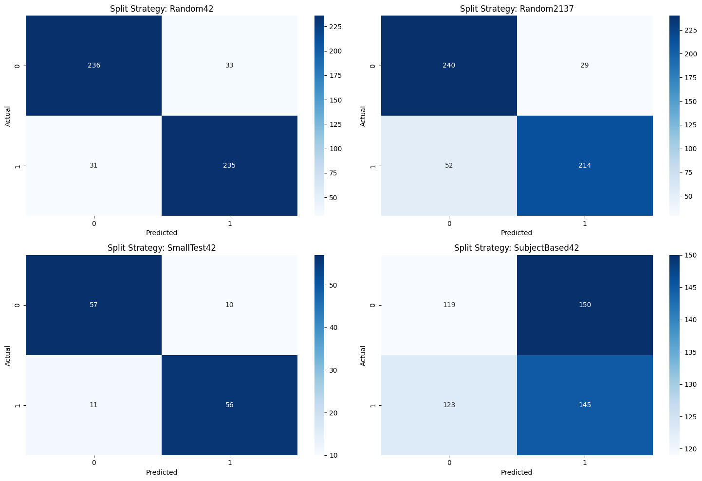

# Random Forest

## Overview

This folder contains the implementation and results of the Random Forest model used in our experiments. It includes scripts for training and evaluating the model, as well as the best results obtained from our hyperparameter and preprocessing parameter searches.

## Folder Structure

- `README.md`: Documentation for the Random Forest folder.
- `RandomForestModel.py`: Implementation of the Random Forest model.
- `best_random_forest_conf_matrix.png`: Confusion matrix of the best Random Forest model.
- `final_runs.ipynb`: Jupyter notebook for running final Random Forest experiments.
- `result_analysis.ipynb`: Jupyter notebook for analyzing the results.

### `best_results`

Contains the best results for different data splits.

- `Random2137`: Results for the Random2137 split.
- `Random42`: Results for the Random42 split.
- `SmallTest42`: Results for the SmallTest42 split.
- `SubjectBased42`: Results for the SubjectBased42 split.

## Usage

To get started, explore the `final_runs.ipynb` notebook to understand the final experiments conducted with the Random Forest model. Use the `RandomForestModel.py` script to implement and train the Random Forest model. Analyze the results using the `result_analysis.ipynb` notebook.

## Confusion Matrix

Below is the confusion matrix for the best Random Forest model:

The confusion matrices for the best-performing Random Forest model across different splits are shown in the figure above. Non-subject-based splits generally result in a more balanced distribution of predicted labels. In contrast, subject-based splits tend to overpredict label 1, leading to a higher number of false positives compared to true positives. This bias is likely due to the limited diversity of subjects in the training data, which restricts the model's ability to generalize to new, unseen individuals.
